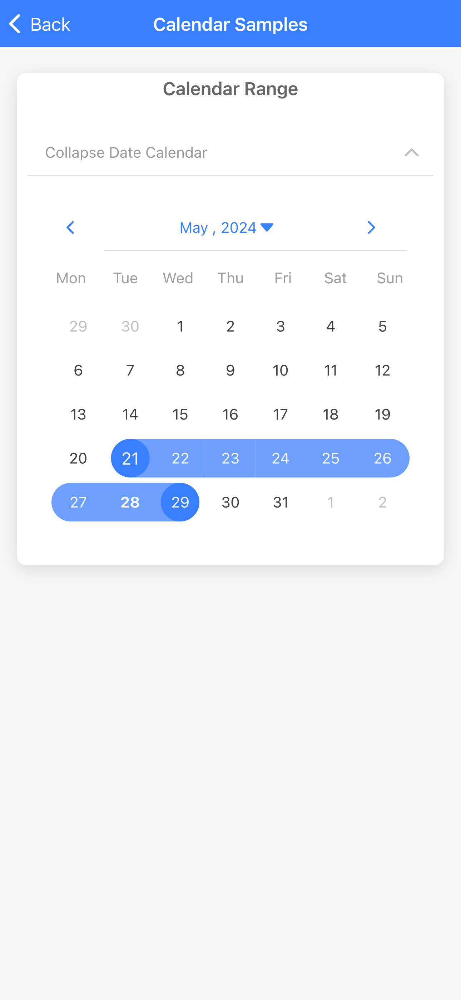
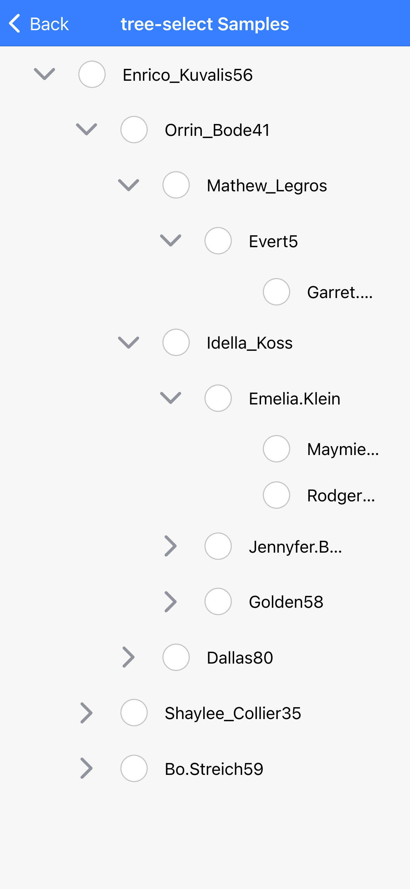

# Ionic Component Snippets

This repository showcases demos and libraries that aren't officially supported by Ionic yet, but can be useful for developers and their apps. Feel free to explore and use the featured components!

**Note:** Third-party components may not be actively maintained and could introduce compatibility issues in future Ionic releases. Use them with caution and consider potential upgrade challenges.

## Preview

### Online Preview

[Preview URL](https://ionic-component-snippets.vercel.app)

## User Guide: How to Implement the Component Snippets

This guide provides a step-by-step explanation to help you set up, run, and integrate the components from this repository into your own project.

### 1. Prerequisites

Before getting started, ensure that you have the following installed on your system:

- **Node.js (version >= 18.x)**  
  Angular 18 requires at least Node.js version 18.x or higher. You can download it from [nodejs.org](https://nodejs.org/). To verify if Node.js is already installed, run:

  ```bash
  node -v
  ```

  If it shows a version lower than 18.x or you do not have Node.js installed, please download and install the latest version.

- **NPM (version >= 9.x)**  
  NPM (Node Package Manager) comes bundled with Node.js. Ensure that you have version 9.x or later installed. You can check the installed version with:

  ```bash
  npm -v
  ```

- **Angular CLI (version >= 18.x)**  
  Angular CLI is required to manage and build Angular applications. If you do not have it installed or if you have an older version, install or update it globally:

  ```bash
  npm install -g @angular/cli@latest
  ```

  To verify the installed version of Angular CLI:

  ```bash
  ng version
  ```

- **Ionic CLI (latest version)**  
  Install the Ionic CLI globally to manage and run Ionic apps:

  ```bash
  npm install -g @ionic/cli@latest
  ```

  To verify the installed version:

  ```bash
  ionic -v
  ```

- **NX CLI (latest version)**  
  NX CLI is required for monorepo support and workspace management. Install it globally:

  ```bash
  npm install -g nx@latest
  ```

  To check the installed version:

  ```bash
  nx --version
  ```

- **Capacitor CLI (latest version)**  
  Capacitor is needed for building and deploying mobile apps. Install it globally:

  ```bash
  npm install -g @capacitor/cli@latest
  ```

  To verify the installed version:

  ```bash
  npx cap -v
  ```

- **Git**  
  You will need Git for version control and to clone the repository. If you do not have Git installed, download it from [git-scm.com](https://git-scm.com/) or install it using a package manager. To verify Git installation:

  ```bash
  git --version
  ```

### 2. Clone the Repository

Once the prerequisites are set, clone the repository to your local machine:

```bash
git clone https://github.com/LennonReid/ionic-component-snippets.git
cd ionic-component-snippets
```

### 3. Install Dependencies

After cloning the repository, navigate to the project directory and install all necessary dependencies. Since Angular 18 requires specific versions of libraries, ensure all dependencies are installed correctly using:

```bash
npm install
```

This command will install all the libraries listed in the `package.json` file. Ensure you have a stable internet connection as this will download various packages.

### 4. Running the Project Locally

To serve the project locally, use NX to start the development server:

```bash
nx serve
```

Once the server is running, you can access the application by navigating to `http://localhost:4200` in your web browser. This will display the demo app with all available components.

### 5. Using Components in Your Own Project

To integrate any of the components from this repository into your own project, follow these steps:

1. **Add the Component:**
   Navigate to the specific component folder in this repository (e.g., `libs/components/calendar` for the calendar component) and copy the entire folder containing the component/module into your Angular project's `src/app` directory or another appropriate location in your project.

   For example, to use the calendar component:

   - Copy the entire `libs/components/calendar` folder from this repository into your Angular project's `src/app/components` (or any other directory of your choice).

   Ensure that the folder structure and files remain intact.

2. **Import the Component:**
   After copying the module files, you need to import the module into your Angular project.

   Open your `app.module.ts` file (or the module file where you want to use the component) and import the module. For example, if you copied the calendar component:

   ```typescript
   import { CalendarModule } from './components/calendar/calendar.module'; // Adjust the path based on where you copied the module

   @NgModule({
     declarations: [...],
     imports: [
       ...,
       CalendarModule, // Import the copied module here
     ],
     providers: [],
     bootstrap: [AppComponent]
   })
   export class AppModule {}
   ```

3. **Use the Component in Your HTML:**
   After importing the module, you can use the component in your HTML templates. For example, if you are using the calendar component:

   ```html
   <ion-calendar [(ngModel)]="selectedDate"></ion-calendar>
   ```

   The component should now be fully functional in your Angular project.

4. **Check for Additional Dependencies:**
   Some components might require additional libraries or styles. Make sure to check the component documentation and ensure all dependencies are installed.

### 6. Building the Project for Production

When you are ready to build the project for production, use the following command:

```bash
nx build
```

This will compile the project and generate the production-ready code in the `dist/` folder.

### 7. Running on a Mobile Device

To run the project on a real mobile device using Capacitor, follow these steps:

1. **Add a Mobile Platform:**

   If you are targeting iOS or Android, you need to add the corresponding platform to your project. Run the following command:

   ```bash
   npx cap add ios
   npx cap add android
   ```

2. **Sync Capacitor:**

   After adding the platform, sync your web project with Capacitor:

   ```bash
   npx cap sync
   ```

3. **Open the Platform in an IDE:**

   Open the native project in Xcode (for iOS) or Android Studio (for Android):

   ```bash
   npx cap open ios
   npx cap open android
   ```

4. **Run the App:**

   From Xcode or Android Studio, build and run the project on a real device or an emulator.

### 8. Troubleshooting

Here are some common issues you might encounter and how to resolve them:

- **Dependency Errors:**  
  If you see errors related to missing dependencies, ensure you have run `npm install` and all required packages are listed in your `package.json`.

- **Capacitor Sync Issues:**  
  Ensure you have added the correct platforms (iOS or Android) using `npx cap add ios/android`, and try running `npx cap sync` again to resolve any sync issues.

- **Build Failures:**  
  If the project fails to build, ensure you are using the correct versions of Node.js, NPM, and Angular CLI. Updating to the latest versions often solves compatibility issues.

- **Serving Issues:**  
  If `nx serve` fails to start the server, check if another service is already using port 4200 or try restarting your development server.

## Component Categories

This repository is categorized into two sections:

- **Officially Supported Components:** These components are part of the Ionic framework and receive ongoing maintenance from the Ionic team.
- **Third-Party Components:** These components are developed by the community and offer additional features beyond the core Ionic framework.

## Officially Supported Components (work in progress)

- **@ionic-team/capacitor-barcode-scanner:** Capacitor plugin using Outsystems Barcode libs.
  [The original repository](https://github.com/ionic-team/capacitor-barcode-scanner)

## Third-Party Components

- **@calendar ([Library](https://github.com/LennonReid/ionic-component-snippets/tree/main/libs/components/calendar) | [Sample](https://github.com/LennonReid/ionic-component-snippets/tree/main/libs/samples/calendar)):** Provides a feature-rich calendar component for date and time selection.
  
  [The original repository](https://github.com/HsuanXyz/ion2-calendar)

- **@select-search ([Library](https://github.com/LennonReid/ionic-component-snippets/tree/main/libs/components/select-search) | [Sample](https://github.com/LennonReid/ionic-component-snippets/tree/main/libs/samples/select-search)):** Enhances Ionic's native select component with additional functionalities.
  [The original repository](https://github.com/eakoriakin/ionic-selectable)
  

- **@code-scanner ([Library](https://github.com/LennonReid/ionic-component-snippets/tree/main/libs/components/code-scanner) | [Sample](https://github.com/LennonReid/ionic-component-snippets/tree/main/libs/samples/code-scanner)):** Integrates barcode scanning functionality into your Ionic app.
  [The original repository](https://github.com/robingenz/ionic-capacitor-barcode-scanner)

- **@slide-segments ([Library](https://github.com/LennonReid/ionic-component-snippets/tree/main/libs/components/slide-segments) | [Sample](https://github.com/LennonReid/ionic-component-snippets/tree/main/libs/samples/slide-segments)):** A custom component combining Swiper and Ion-Segment, offering features like height adaptation and on-demand loading.
  

- **@tree-select ([Library](https://github.com/LennonReid/ionic-component-snippets/tree/main/libs/components/tree-select) | [Sample](https://github.com/LennonReid/ionic-component-snippets/tree/main/libs/samples/tree-select)):** Provides a tree view component for hierarchical data visualization.
  
  [The original repository](https://github.com/heyligengregory/ionic-tree-view)

**We welcome contributions!** If you've found a useful component that isn't listed here, feel free to submit a pull request to add it.
